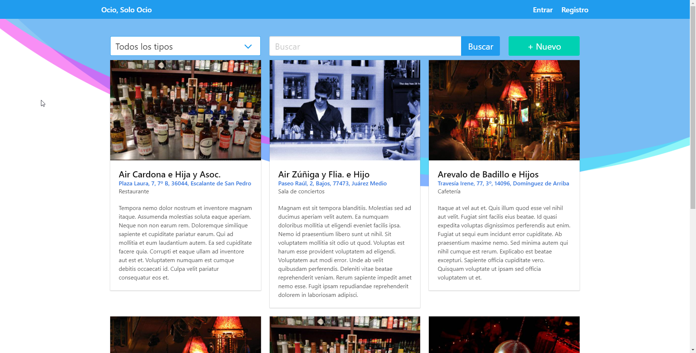

# Oso.test (Ocio Solo Ocio)
Aplicación rápida para una prueba de programación. 



Tiene
- Front con una selección de lugares de ocio [🔗](_pantallazos/index.png)
- Back con un CRUD para operar sobre los datos. [🔗](_pantallazos/editar.png)
- Login/registro de usuarios [🔗](_pantallazos/login.png)
- Valoraciones y comentarios sobre los lugares. [🔗](_pantallazos/comentarios.png)
- Busqueda en tiempo real XHR, Vue [🔗](_pantallazos/filtrar.png)
- Generador de datos aleatorios para agilizar el desarrollo, incluyendo imágenes y coordenadas de los sitios 
- Los datos se almacenan en MongoDb usando una implementación del ORM de laravel (Eloquent -> Moloquent)
- Seguridad (SQL, CSRF, Auth,...)
 
> Pantallazos [🔗](_pantallazos/)


Tech Stack:

- Servidor (PHP 7.4)  
    - Laravel 5.8  
    - Faker  
    - jenssegers/mongodb  
    - Dependencias via composer  
 
- Cliente   
    - Vue (JS)  
    - Blade (PHP)  
    - Bulma (CSS)  
    - Font Awesome (Iconos)  
    - Dependencias via npm  

- BBDD:  
    - MongoDB  

Requisitos:   
- Servidor local tipo XAMPP/WAMP con PHP 7.4 (Recomiendo [Laragon](https://laragon.org/) )  
- [Node y npm](https://nodejs.org/es/)  
- [Extensión MongoDB en PHP](https://www.php.net/manual/es/mongodb.installation.windows.php), en este caso uso la disponible para PHP 7.4 x64 TS en Windows mediante su [dll](https://pecl.php.net/package/mongodb/1.10.0/windows)  
- Composer 1, si tienes una versión más actualizada la puedes bajar con ``composer self-update --1``
- MongoDB 3.6 (``mongod.exe --dbpath ./data``)  


Instalación:
- Preparar un servidor local tipo XAMPP, recomiendo Laragon  
- Instalar dependencias de composer: ```composer install``  
- Instalar dependencias de npm: ```npm install``  
- Copiar el fichero de entorno y configurar si es necesesario los datos de acceso a bbdd `cp .env.example .env`  
- Ediar las siguientes claves:  
```
APP_URL=http://oso.test

DB_CONNECTION=mongodb
DB_HOST=127.0.0.1
DB_PORT=27017
DB_DATABASE=oso
DB_USERNAME=
DB_PASSWORD=
```
- Ejecutar migraciones de laravel (crear bbdd) ``php artisan migrate:fresh``  
- Ejecutar seeds de laravel ``php artisan db:seed`` 🌱    
- Generar las claves ``php artisan key:generate`` 🔑  
- Ejecutar ``npm run dev`` pnpm rara compilar assets cliente  
- Preparar DNS ``127.0.0.1      oso.test``  
- Acceder a ``oso.test``  
- Usuario ``admin@oso.test``, contraseña de todos los usuarios ``secret``  

Si no falta nada, debería estar funcionando en la dirección que corresponda.  
